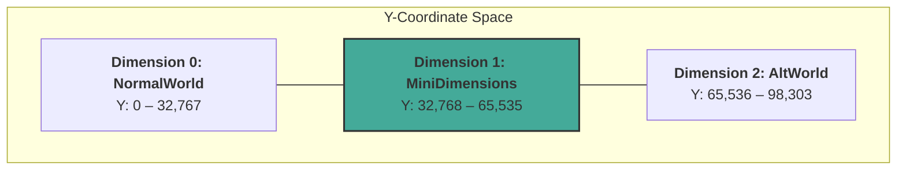
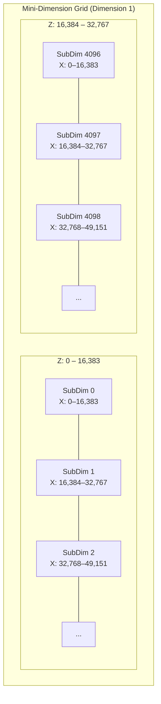
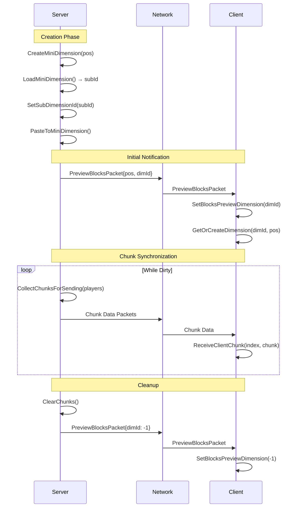
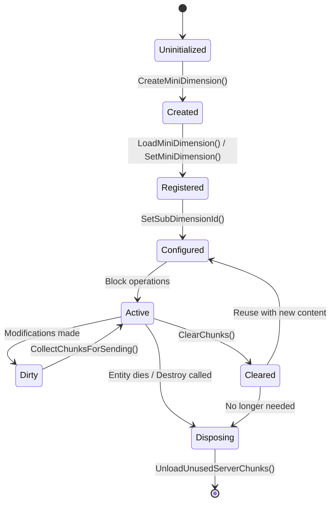

# Mini-Dimensions Technical Reference

> **Target Audience:** Advanced Modders  
> **API Version:** Vintage Story 1.19+

## Overview

Mini-dimensions are isolated block spaces within **Dimension 1** (`Dimensions.MiniDimensions`), providing independent 16,384 × 16,384 × (world height) block volumes. They enable:

- **Schematic Previews** — Ghost-render block placements before committing (WorldEdit)
- **Moving Structures** — Vehicles, ships, or contraptions that move through the world
- **Dynamic Block Systems** — Isolated environments for simulations or instanced content

Mini-dimensions implement `IBlockAccessor`, allowing standard block operations while maintaining separation from the main world. They support custom render transforms (position, rotation) and server-client chunk synchronization.

---

## Coordinate System

### Dimension Boundaries

Vintage Story encodes the dimension into the Y-coordinate using a boundary system:

```
DimensionBoundary = 32,768 blocks (1,024 chunks × 32 blocks/chunk)
```



| Dimension ID | Name             | Y Range         | Purpose                                     |
| ------------ | ---------------- | --------------- | ------------------------------------------- |
| 0            | `NormalWorld`    | 0 – 32,767      | Main game world                             |
| 1            | `MiniDimensions` | 32,768 – 65,535 | Container for all mini-dimensions           |
| 2            | `AltWorld`       | 65,536 – 98,303 | Time-switched alternate world (Devastation) |

### Y-Encoding Formula

The `BlockPos` class encodes dimension into `InternalY`:

```csharp
// From BlockPos.cs
public const int DimensionBoundary = 32768;

public int InternalY {
    get { return Y + dimension * DimensionBoundary; }
    set {
        Y = value % DimensionBoundary;
        dimension = value / DimensionBoundary;
    }
}
```

**Example:** A block at local Y=100 in dimension 1 has `InternalY = 100 + 1 × 32768 = 32868`

### Sub-Dimension Indexing

Within dimension 1, mini-dimensions are assigned unique **sub-dimension IDs** based on their XZ position:



**Indexing Formula:**

```csharp
// From Dimensions.cs
public const int subDimensionSize = 16384;              // 16k blocks per axis
public const int subDimensionIndexZMultiplier = 4096;   // MaxWorldSizeXZ / subDimensionSize

public static int SubDimensionIdForPos(int posX, int posZ) {
    return (posZ / subDimensionSize) * subDimensionIndexZMultiplier + (posX / subDimensionSize);
}
```

| Constant                       | Value         | Derivation                          |
| ------------------------------ | ------------- | ----------------------------------- |
| `subDimensionSize`             | 16,384        | `DimensionBoundary / 2`             |
| `subDimensionIndexZMultiplier` | 4,096         | `MaxWorldSizeXZ / subDimensionSize` |
| Max sub-dimensions             | ~16.7 million | `4096 × 4096`                       |

---

## Core API

### IMiniDimension Interface

**Source:** `vsapi/Common/API/IMiniDimension.cs`

`IMiniDimension` extends `IBlockAccessor` with dimension-specific functionality:

```csharp
public interface IMiniDimension : IBlockAccessor
{
    // ─── Identity ───────────────────────────────────────────────────────
    int subDimensionId { get; set; }                    // Unique ID within dimension 1

    // ─── Position & State ───────────────────────────────────────────────
    EntityPos CurrentPos { get; set; }                  // World position (can include yaw/pitch/roll)
    bool Dirty { get; set; }                            // True if chunks need syncing

    // ─── Selection Tracking (WorldEdit) ─────────────────────────────────
    bool TrackSelection { get; set; }                   // Follow player's selection
    BlockPos selectionTrackingOriginalPos { get; set; } // Original placement position

    // ─── Preview Mode ───────────────────────────────────────────────────
    int BlocksPreviewSubDimension_Server { get; set; }  // Non-zero = preview (no ticking)

    // ─── Chunk Management ───────────────────────────────────────────────
    void ClearChunks();                                 // Empty all chunks (keeps allocated)
    void UnloadUnusedServerChunks();                    // Release empty chunks from memory
    void CollectChunksForSending(IPlayer[] players);    // Queue dirty chunks for network sync

    // ─── Client Sync ────────────────────────────────────────────────────
    void ReceiveClientChunk(long chunkIndex3d, IWorldChunk chunk, IWorldAccessor world);

    // ─── Rendering ──────────────────────────────────────────────────────
    FastVec3d GetRenderOffset(float dt);                // Interpolated position for smooth motion
    void SetRenderOffsetY(int offsetY);                 // Manual Y offset adjustment
    float[] GetRenderTransformMatrix(float[] currentModelViewMatrix, Vec3d playerPos);

    // ─── Configuration ──────────────────────────────────────────────────
    void SetSubDimensionId(int dimensionId);            // Assign sub-dimension ID
    void SetSelectionTrackingSubId_Server(int dimensionId);
    void AdjustPosForSubDimension(BlockPos pos);        // Offset pos into sub-dimension space
}
```

### Server-Side APIs

**Source:** `vsapi/Server/API/IServerAPI.cs`

```csharp
public interface IServerAPI
{
    /// <summary>
    /// Register a new mini-dimension and receive an auto-allocated sub-dimension ID.
    /// </summary>
    int LoadMiniDimension(IMiniDimension blocks);

    /// <summary>
    /// Register a mini-dimension at a specific sub-dimension ID (for reuse/persistence).
    /// </summary>
    int SetMiniDimension(IMiniDimension miniDimension, int subId);

    /// <summary>
    /// Retrieve an existing mini-dimension by its sub-dimension ID.
    /// </summary>
    IMiniDimension GetMiniDimension(int subId);
}
```

### Client-Side APIs

**Source:** `vsapi/Client/API/IClientWorldAccessor.cs`

```csharp
public interface IClientWorldAccessor : IWorldAccessor
{
    /// <summary>
    /// All loaded mini-dimensions on the client, keyed by sub-dimension ID.
    /// </summary>
    Dictionary<int, IMiniDimension> MiniDimensions { get; }

    /// <summary>
    /// Get or create a client-side mini-dimension at the given position.
    /// </summary>
    IMiniDimension GetOrCreateDimension(int dimId, Vec3d pos);

    /// <summary>
    /// Check if a mini-dimension exists at the given origin.
    /// </summary>
    bool TryGetMiniDimension(Vec3i origin, out IMiniDimension dimension);

    /// <summary>
    /// Set which mini-dimension should render as a preview overlay.
    /// Pass -1 to disable preview rendering.
    /// </summary>
    void SetBlocksPreviewDimension(int dimId);
}
```

### EntityChunky Class

**Source:** `vsapi/Common/Entity/EntityChunky.cs`

`EntityChunky` is an entity that owns and moves with a mini-dimension:

```csharp
public class EntityChunky : Entity
{
    protected IMiniDimension blocks;      // The associated mini-dimension
    protected int subDimensionIndex;      // Cached sub-dimension ID

    /// <summary>
    /// Create a new EntityChunky and link it to an existing mini-dimension.
    /// </summary>
    public static EntityChunky CreateAndLinkWithDimension(ICoreServerAPI sapi, IMiniDimension dimension);

    /// <summary>
    /// Associate this entity with a mini-dimension (updates position, stores ID in attributes).
    /// </summary>
    public void AssociateWithDimension(IMiniDimension blocks)
    {
        this.blocks = blocks;
        this.subDimensionIndex = blocks.subDimensionId;
        (WatchedAttributes.GetAttribute("dim") as IntAttribute).value = this.subDimensionIndex;
        this.ServerPos.SetFrom(blocks.CurrentPos);
        this.Pos = blocks.CurrentPos;
    }
}
```

---

## Creation & Registration

### Server-Side Creation Flow

```csharp
// 1. Create the mini-dimension from any block accessor
IMiniDimension miniDim = world.BlockAccessor.CreateMiniDimension(new Vec3d(x, y, z));

// 2. Register with server to get a unique sub-dimension ID
int subId = sapi.Server.LoadMiniDimension(miniDim);

// 3. Configure the mini-dimension
miniDim.SetSubDimensionId(subId);

// 4. (Optional) Mark as preview to disable block ticking
miniDim.BlocksPreviewSubDimension_Server = subId;
```

### Reusing an Existing ID

When persisting mini-dimensions across sessions or reusing IDs:

```csharp
// Use SetMiniDimension instead of LoadMiniDimension
sapi.Server.SetMiniDimension(miniDim, existingSubId);
miniDim.SetSubDimensionId(existingSubId);
```

### Client-Side Initialization

Clients receive mini-dimensions via network packets and initialize them:

```csharp
// Triggered by receiving PreviewBlocksPacket or similar
capi.World.SetBlocksPreviewDimension(subId);

if (subId >= 0) {
    IMiniDimension dim = capi.World.GetOrCreateDimension(subId, originPos.ToVec3d());
    dim.selectionTrackingOriginalPos = originPos;
    dim.TrackSelection = shouldTrack;
}
```

---

## Block Manipulation

### Positioning Blocks

Block positions must be adjusted for the sub-dimension's coordinate offset:

```csharp
BlockPos originPos = startPos.Copy();

// Set the dimension flag
originPos.SetDimension(Dimensions.MiniDimensions);  // dimension = 1

// Adjust XZ coordinates into sub-dimension space
miniDim.AdjustPosForSubDimension(originPos);

// Now use miniDim as IBlockAccessor for operations
miniDim.SetBlock(blockId, originPos);
```

### Pasting Schematics

Use `BlockSchematic.PasteToMiniDimension()` for bulk placement:

```csharp
// From BlockSchematic.cs
public void PasteToMiniDimension(
    ICoreServerAPI sapi,
    IBlockAccessor blockAccess,      // For resolving block IDs
    IMiniDimension miniDimension,    // Target mini-dimension
    BlockPos originPos,              // Already adjusted for sub-dimension
    bool replaceMetaBlocks)
{
    this.Init(blockAccess);
    this.Place(miniDimension, sapi.World, originPos, EnumReplaceMode.ReplaceAll, replaceMetaBlocks);
    this.PlaceDecors(miniDimension, originPos);
}
```

### Complete Placement Example

```csharp
public IMiniDimension CreateDimensionFromSchematic(BlockSchematic blockData, BlockPos startPos)
{
    // Create or clear mini-dimension
    if (previewBlocks == null) {
        previewBlocks = blockAccess.CreateMiniDimension(new Vec3d(startPos.X, startPos.Y, startPos.Z));
        DimensionId = sapi.Server.LoadMiniDimension(previewBlocks);
    } else {
        previewBlocks.ClearChunks();
        previewBlocks.CurrentPos.SetPos(startPos);
    }

    // Configure
    previewBlocks.SetSubDimensionId(DimensionId);
    previewBlocks.BlocksPreviewSubDimension_Server = DimensionId;  // Preview mode

    // Prepare origin position
    BlockPos originPos = startPos.Copy();
    originPos.SetDimension(Dimensions.MiniDimensions);
    previewBlocks.AdjustPosForSubDimension(originPos);

    // Paste schematic
    blockData.PasteToMiniDimension(sapi, blockAccess, previewBlocks, originPos, replaceMetaBlocks: false);

    return previewBlocks;
}
```

---

## Rendering & Transforms

### Render Offset Interpolation

For smooth movement, mini-dimensions provide interpolated positions:

```csharp
// Called each render frame with delta time
FastVec3d offset = miniDim.GetRenderOffset(dt);

// Manual Y adjustment (e.g., for floating structures)
miniDim.SetRenderOffsetY(offsetY);
```

### Transform Matrix

For rotation and positioning, use the transform matrix:

```csharp
float[] transformMatrix = miniDim.GetRenderTransformMatrix(currentModelViewMatrix, playerPos);
```

### Rotation with EntityChunky

`EntityPos` supports pitch, yaw, and roll for full 3D rotation:

```csharp
// From EntityTestShip.cs - Ship motion simulation
public override void OnGameTick(float dt)
{
    base.OnGameTick(dt);

    // Forward motion
    this.SidedPos.Motion.X = 0.01;

    // Rotation around Y axis (turning)
    Pos.Yaw = (float)(Pos.X % 6.3) / 20;

    // Rotation around Z axis (pitching)
    Pos.Pitch = (float)GameMath.Sin(Pos.X % 6.3) / 5;

    // Rotation around X axis (rolling)
    Pos.Roll = (float)GameMath.Sin(Pos.X % 12.6) / 3;
}
```

| Property | Axis | Description                             |
| -------- | ---- | --------------------------------------- |
| `Yaw`    | Y    | Horizontal rotation (compass direction) |
| `Pitch`  | Z    | Forward/backward tilt                   |
| `Roll`   | X    | Side-to-side tilt                       |

---

## Server-Client Synchronization

### Sync Flow Diagram



### Network Packet Structure

```csharp
[ProtoContract]
public class PreviewBlocksPacket
{
    [ProtoMember(1)]
    public BlockPos pos;          // World origin position

    [ProtoMember(2)]
    public int dimId;             // Sub-dimension ID (-1 to disable)

    [ProtoMember(3)]
    public bool TrackSelection;   // Follow player's current selection
}
```

### Dirty Chunk Management

```csharp
// Server marks dimension dirty after modifications
miniDim.Dirty = true;

// During server tick, sync dirty chunks to relevant players
miniDim.CollectChunksForSending(nearbyPlayers);

// Client receives and applies chunk data
miniDim.ReceiveClientChunk(chunkIndex3d, chunk, world);
```

---

## Lifecycle Management

### State Diagram



### Cleanup Patterns

**Temporary Preview (reusable):**

```csharp
// Clear content but keep dimension allocated
previewBlocks.ClearChunks();
previewBlocks.UnloadUnusedServerChunks();

// Notify client to stop rendering
SendPacket(new PreviewBlocksPacket { dimId = -1 });
```

**Permanent Disposal (EntityChunky death):**

```csharp
public override void Die(EnumDespawnReason reason, DamageSource source)
{
    base.Die(reason, source);

    if (Api.Side == EnumAppSide.Server && blocks != null) {
        blocks.ClearChunks();
        blocks.UnloadUnusedServerChunks();
    }
}
```

### Tick Prevention for Previews

Preview dimensions should not tick (no block updates, entity AI, etc.):

```csharp
// From Dimensions.cs
public static bool ShouldNotTick(BlockPos pos, ICoreAPI api)
{
    if (pos.dimension != MiniDimensions) return false;

    int subId = SubDimensionIdForPos(pos.X, pos.Z);

    if (api is ICoreServerAPI sapi) {
        IMiniDimension dim = sapi.Server.GetMiniDimension(subId);
        if (dim == null) return false;
        return dim.BlocksPreviewSubDimension_Server == subId;  // Is preview?
    }

    return subId == BlocksPreviewSubDimension_Client;
}
```

---

## Examples

### Example 1: Static Preview (WorldEdit Pattern)

A ghost preview of a schematic that follows the player's selection:

```csharp
public class SchematicPreview
{
    private IMiniDimension previewBlocks;
    private int dimensionId = -1;
    private ICoreServerAPI sapi;
    private IServerNetworkChannel channel;

    public void ShowPreview(BlockSchematic schematic, BlockPos origin, IServerPlayer player)
    {
        // Create or reuse mini-dimension
        if (previewBlocks == null) {
            previewBlocks = sapi.World.BlockAccessor.CreateMiniDimension(origin.ToVec3d());
            dimensionId = sapi.Server.LoadMiniDimension(previewBlocks);
        } else {
            previewBlocks.ClearChunks();
            previewBlocks.CurrentPos.SetPos(origin);
        }

        // Configure as preview (no ticking)
        previewBlocks.SetSubDimensionId(dimensionId);
        previewBlocks.BlocksPreviewSubDimension_Server = dimensionId;

        // Prepare position and paste
        BlockPos pastePos = origin.Copy();
        pastePos.SetDimension(Dimensions.MiniDimensions);
        previewBlocks.AdjustPosForSubDimension(pastePos);

        schematic.PasteToMiniDimension(sapi, sapi.World.BlockAccessor, previewBlocks, pastePos, false);
        previewBlocks.UnloadUnusedServerChunks();

        // Notify client
        channel.SendPacket(new PreviewBlocksPacket {
            pos = origin,
            dimId = dimensionId,
            TrackSelection = true
        }, player);
    }

    public void HidePreview(IServerPlayer player)
    {
        previewBlocks?.ClearChunks();
        previewBlocks?.UnloadUnusedServerChunks();

        channel.SendPacket(new PreviewBlocksPacket {
            pos = previewBlocks?.selectionTrackingOriginalPos,
            dimId = -1
        }, player);
    }
}
```

### Example 2: Moving Entity (Ship Pattern)

A structure that moves through the world with physics:

```csharp
public class EntityShip : EntityChunky
{
    public static EntityShip Create(ICoreServerAPI sapi, BlockSchematic schematic, BlockPos origin)
    {
        // Create mini-dimension
        IMiniDimension dimension = sapi.World.BlockAccessor.CreateMiniDimension(origin.ToVec3d());
        int subId = sapi.Server.LoadMiniDimension(dimension);
        dimension.SetSubDimensionId(subId);

        // Paste schematic into dimension
        BlockPos pastePos = origin.Copy();
        pastePos.SetDimension(Dimensions.MiniDimensions);
        dimension.AdjustPosForSubDimension(pastePos);
        schematic.PasteToMiniDimension(sapi, sapi.World.BlockAccessor, dimension, pastePos, false);

        // Create entity and link
        EntityShip ship = (EntityShip)sapi.World.ClassRegistry.CreateEntity("EntityShip");
        ship.Code = new AssetLocation("mymod:ship");
        ship.AssociateWithDimension(dimension);

        return ship;
    }

    public override void OnGameTick(float dt)
    {
        if (blocks == null || SidedPos == null) return;
        base.OnGameTick(dt);

        // Apply motion
        SidedPos.Motion.X = Math.Cos(Pos.Yaw) * speed;
        SidedPos.Motion.Z = Math.Sin(Pos.Yaw) * speed;

        // Apply wave motion
        Pos.Pitch = (float)Math.Sin(Api.World.ElapsedMilliseconds / 1000.0) * 0.05f;
        Pos.Roll = (float)Math.Sin(Api.World.ElapsedMilliseconds / 800.0) * 0.03f;
    }

    public override void Die(EnumDespawnReason reason, DamageSource source)
    {
        base.Die(reason, source);

        if (Api.Side == EnumAppSide.Server && blocks != null) {
            blocks.ClearChunks();
            blocks.UnloadUnusedServerChunks();
        }
    }
}
```

### Example 3: Launch Command (Convert Selection to Ship)

From WorldEdit's `/we launch` command:

```csharp
private TextCommandResult HandleLaunch(TextCommandCallingArgs args)
{
    // Copy selection to schematic
    BlockSchematic schematic = CopyArea(startMarker, endMarker, includeEntities: true);

    // Clear original blocks
    FillArea(null, startMarker, endMarker);

    // Create mini-dimension from schematic
    BlockPos launchPos = startMarker.Copy();
    launchPos.Add(schematic.PackedOffset);

    IMiniDimension dimension = CreateDimensionFromSchematic(schematic, launchPos);
    if (dimension == null) {
        return TextCommandResult.Error("No more mini-dimensions available");
    }

    // Create and spawn ship entity
    Entity ship = EntityTestShip.CreateShip(sapi, dimension);
    ship.ServerPos.SetFrom(launchPos);
    ship.Pos.SetFrom(launchPos);
    sapi.World.SpawnEntity(ship);

    return TextCommandResult.Success($"{schematic.BlockIds.Count} blocks launched");
}
```

---

## Quick Reference

### Key Constants

| Constant                                  | Value  | Location        |
| ----------------------------------------- | ------ | --------------- |
| `Dimensions.NormalWorld`                  | 0      | `Dimensions.cs` |
| `Dimensions.MiniDimensions`               | 1      | `Dimensions.cs` |
| `Dimensions.AltWorld`                     | 2      | `Dimensions.cs` |
| `BlockPos.DimensionBoundary`              | 32,768 | `BlockPos.cs`   |
| `Dimensions.subDimensionSize`             | 16,384 | `Dimensions.cs` |
| `Dimensions.subDimensionIndexZMultiplier` | 4,096  | `Dimensions.cs` |

### Essential Method Checklist

| Task                   | Method                                      |
| ---------------------- | ------------------------------------------- |
| Create mini-dimension  | `blockAccessor.CreateMiniDimension(pos)`    |
| Register (new ID)      | `sapi.Server.LoadMiniDimension(dim)`        |
| Register (existing ID) | `sapi.Server.SetMiniDimension(dim, id)`     |
| Configure ID           | `dim.SetSubDimensionId(id)`                 |
| Mark as preview        | `dim.BlocksPreviewSubDimension_Server = id` |
| Adjust position        | `dim.AdjustPosForSubDimension(pos)`         |
| Paste schematic        | `schematic.PasteToMiniDimension(...)`       |
| Sync to clients        | `dim.CollectChunksForSending(players)`      |
| Clear content          | `dim.ClearChunks()`                         |
| Release memory         | `dim.UnloadUnusedServerChunks()`            |
| Enable client preview  | `capi.World.SetBlocksPreviewDimension(id)`  |
| Disable client preview | `capi.World.SetBlocksPreviewDimension(-1)`  |

---

## See Also

- `vsapi/Common/API/IMiniDimension.cs` — Interface definition
- `vsapi/Config/Dimensions.cs` — Dimension constants and utilities
- `vsapi/Common/Entity/EntityChunky.cs` — Entity-dimension association
- `vsapi/Math/BlockPos.cs` — Coordinate encoding
- `vscreativemod/Workspace.cs` — WorldEdit preview implementation
- `vscreativemod/Entities/EntityTestShip.cs` — Moving entity example
